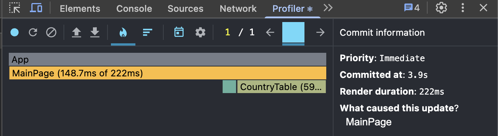
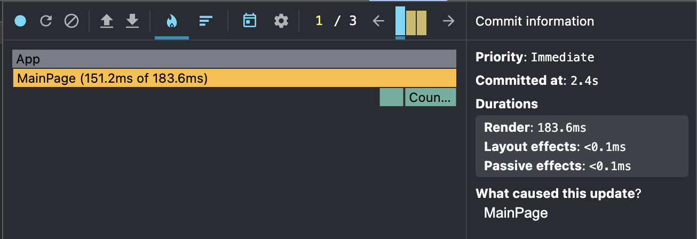
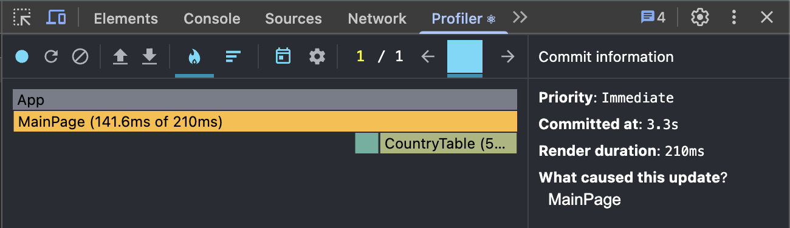
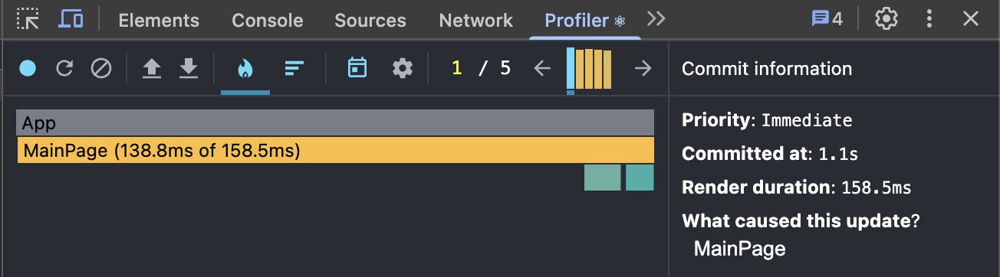
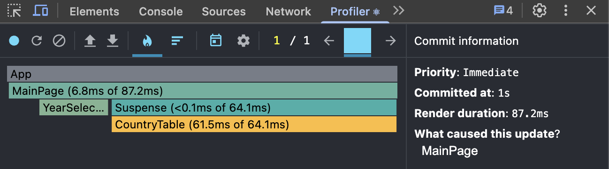
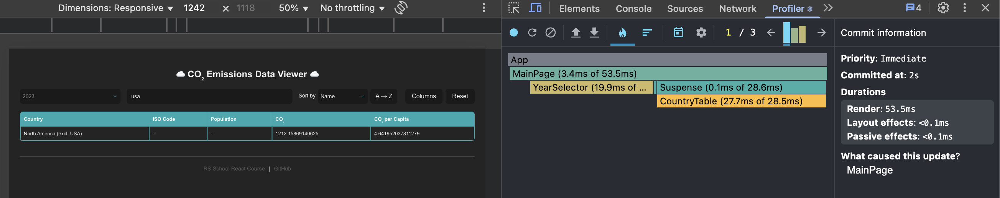
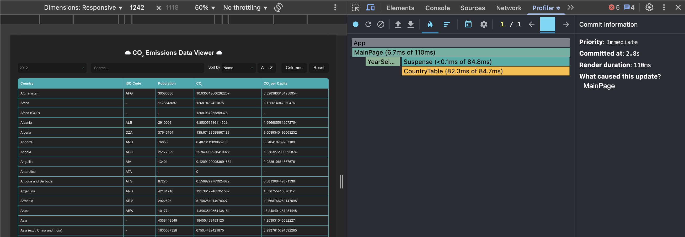
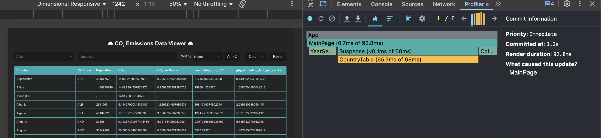

## Performance Analysis

### Before Optimization

| Action                  | Commit Duration (ms) | Render Duration (ms) | Interaction Type |
|-------------------------|-------------------|-------------------|----------------|
| Sorting a column        | 3.9               | 222               | onClick        |
| Searching a country     | 2.4               | 183.6             | onChange       |
| Selecting a year        | 3.3               | 210               | onChange       |
| Adding/removing columns | 1.1               | 158.5             | onClick        |

---

### After Optimization

| Action                  | Commit Duration (ms) | Render Duration (ms) | Interaction Type |
|-------------------------|-------------------|-------------------|----------------|
| Sorting a column        | 1                 | 87.2              | onClick        |
| Searching a country     | 2                 | 53.5              | onChange       |
| Selecting a year        | 2.8               | 110               | onChange       |
| Adding/removing columns | 1.2               | 92.8              | onClick        |

---
 
- Optimization techniques applied:
  - `useMemo` for filtering, searching, sorting
  - `useCallback` for event handlers
  - `React.lazy` and `Suspense` for table component

